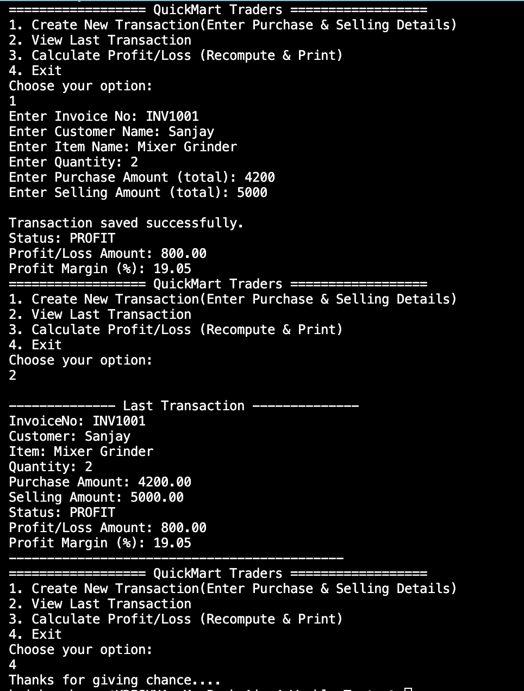
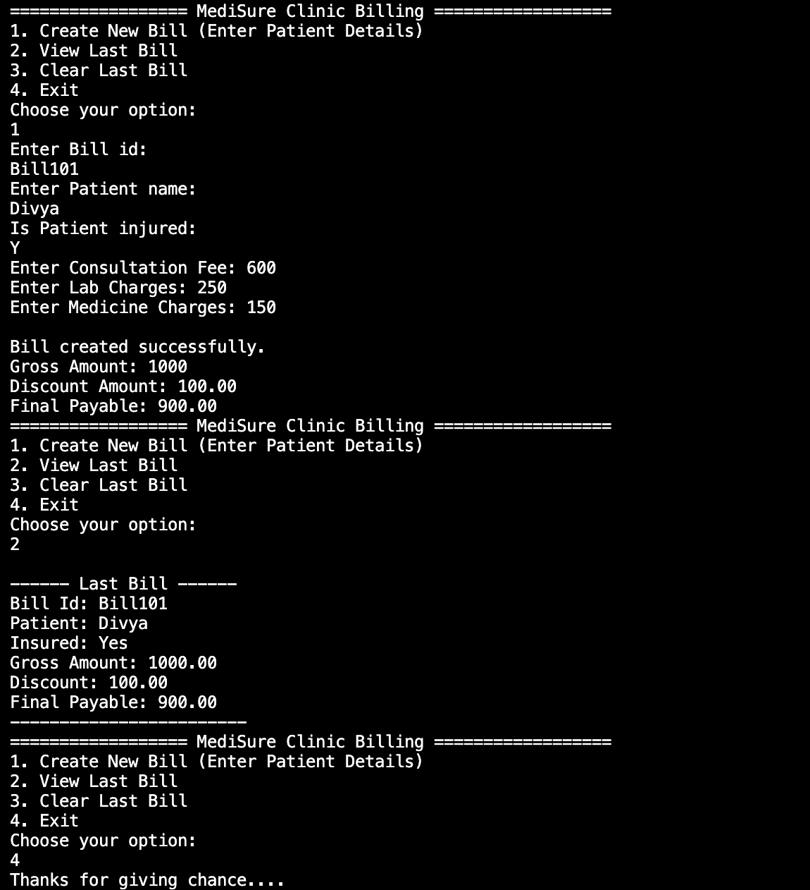

# Databricks & SQL Assessment Banks – Console Applications (C#)

This repository contains **two console-based C# projects** developed as part of assessment banks.  
Both projects follow **clean OOP principles**, **menu-driven flow**, and **console-based interaction**.

---

## 📌 Project 1: QuickMart Traders – Profit Calculator

### 📝 Description
A console-based utility for a retail trader to:
- Capture purchase and selling details
- Calculate **Profit / Loss / Break-even**
- Display **profit margin percentage**
- Store and view the latest transaction

### 🔧 Key Concepts Used
- C# Console I/O
- If–Else & Switch
- Classes & Static Methods
- Input Validation
- Menu-driven Program Flow

### 📸 Output Screenshot


---

## 📌 Project 2: MediSure Clinic – Patient Billing System

### 📝 Description
A simple billing system for a clinic to:
- Capture patient and charge details
- Apply insurance-based discount
- Calculate **gross amount**, **discount**, and **final payable**
- View and clear billing records

### 🔧 Key Concepts Used
- C# OOP Structure
- Business Logic Separation
- Static Data Storage
- Console Formatting
- Validation Handling

### 📸 Output Screenshot


---

## ▶️ How to Run the Projects

```bash
dotnet run
